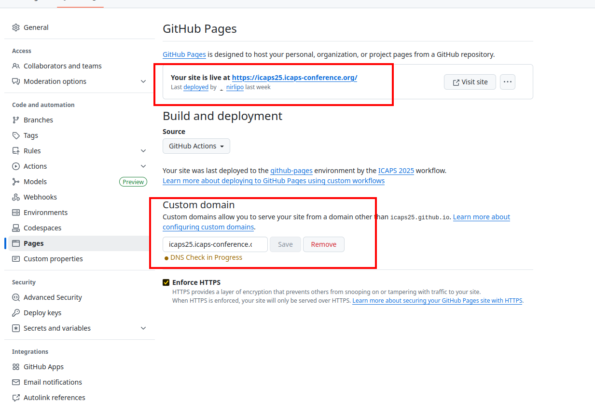

# Install ICAPS Site

Here are some instructions on how to setup a new ICAPS site. 👍

The site is built with [HUGO](https://gohugo.io) framework for automated generation of _static_ web content, and is hosted in [GitHub Pages](https://pages.github.com/).

All development of the website is meant to happen in this repo. When changes are pushed to branch `main`, a GH Actions Workflow will:

1. first _build_ the static pages (by running `hugo`); and then
2. _deploy_ the site into [github-pages](https://docs.github.com/en/pages/getting-started-with-github-pages/configuring-a-publishing-source-for-your-github-pages-site).

See below for how to locally develop the site and how to publish automatically.

- [Install ICAPS Site](#install-icaps-site)
  - [Technology used](#technology-used)
  - [Setup](#setup)
    - [Configure build \& deployment via GH Actions](#configure-build--deployment-via-gh-actions)
    - [Configure a custom domain](#configure-a-custom-domain)
  - [Local Website Development](#local-website-development)
    - [Deployment elsewhere](#deployment-elsewhere)

## Technology used

- [GitHub Pages](https://pages.github.com/): free service provided by GitHub that allows you to host static websites directly from a GitHub repository.
- [HUGO](https://gohugo.io) framework for production of static web pages.
  - A good set of tutorial videos can be found [HERE](https://www.youtube.com/playlist?list=PLLAZ4kZ9dFpOnyRlyS-liKL5ReHDcj4G3).
- [Weather Widget](https://weatherwidget.org/): for the weather widget at the conference location.

## Setup

First, fork the website from the previous edition into your GH organization `icapsXX`.

Make sure the GH repo is named `icapsXX.github.io`, where `XX` is the edition number.

The GitHub Pages website will be available at a default URL: https://icapsXX.github.io

Let us now see how to configure the generation and deployment to GH pages, and custom domain.

### Configure build & deployment via GH Actions

The building and deployment of the static pages can be done via standard GH Actions. The workflow is already provided in script [.github/workflows/hugo.yml](.github/workflows/hugo.yml). Just update the  name of the script:

```yaml
# Sample workflow for building and deploying a Hugo site to GitHub Pages
name: ICAPS 2025
```

Then, configure GitHub Pages to build and deploy using GitHub Actions, as shown here:


The workflow will trigger whenever there is a new push into `main` branch. This will build the static pages and make it available on the following link:

`https://<username>.github.io`

### Configure a custom domain

While GH Pages already provides a default URL name to the web page as shown above, at some point we want to use official ICAPS DNS name of the form https://icapsXX.icaps-conference.org/

GitHub Pages supports using [custom domains](https://docs.github.com/en/pages/configuring-a-custom-domain-for-your-github-pages-site), or changing the root of your site's URL from the default, like `icaps25.github.io`, to any domain you own.

This involves performing two steps:

1. Setting the DNS provider to redirect to the the GH Pages. Done by ICAPS organization.
    - For ICAPS25, this was done by Seven K. by setting up a CNAME redirect `icaps25.icaps-conference.org` --> `icaps25.github.io`
2. Set-up our repo to accept the redirect.

> [!NOTE]
> Note that the GH custom domain instruction steps 1-5 [HERE](https://docs.github.com/en/pages/configuring-a-custom-domain-for-your-github-pages-site/managing-a-custom-domain-for-your-github-pages-site) is a bit different, as step 1 above is not done via CNAME redirect.

Then, for step 2, setup the Pages of the repo to accept the **Custom Domain**:



> [!WARNING]
> Note that the CNAME redirect can take time to propagate and come into effect an (up to 24hrs).

## Local Website Development

It is sometimes convenient to develop and test locally your site _before_ pushing it to the remote repo (which kicks off the deployment workflow to re-build the site).

To test your site locally, just run the following to build the site and bringing up a local server for it:

```shell
$ hugo server
...
Built in 19 ms
Environment: "development"
Serving pages from disk
Running in Fast Render Mode. For full rebuilds on change: hugo server --disableFastRender
Web Server is available at http://localhost:1313/ (bind address 127.0.0.1)
Press Ctrl+C to stop
```

The site can be accessed locally at http://localhost:1313/ and is locally produced in folder `public/` (not tracked by git).

Once happy with the changes to the site, push the changes to the remote repo for building and deployment.

### Deployment elsewhere

Hugo can produce/build the set of static pages that can be copied to any WWW server.

To (only) build the static pages without running the local server:

```shell
$ hugo -t mainroad -d <FOLDER TO BUILD STATIC PAGES>
```

If `-d` is not given, it will be produced in folder `public/`.

If you want to deploy the built web pages to another location than GH (e.g., your uni servers), just copy the content under `public/`.

If the static web pages are meant to live on another web-site, you can use the [`deploy.sh`](deploy.sh) script for copying the built site, and pushing the changes.
